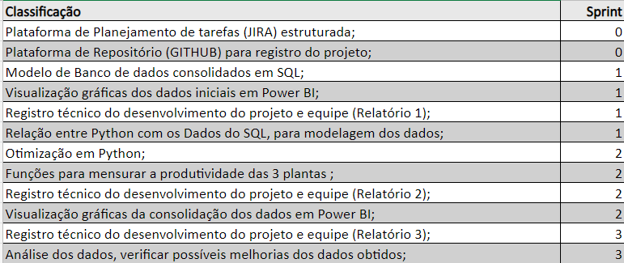

# LogiMaxInsights

# Índice
* [Objetivo do Projeto](#objetivo-do-projeto)
* [Funcionalidades e registros (vídeos e apresentações) das sprints](#funcionalidades-e-registros-(vídeos-e-apresentações)-das-sprints)
* [Backlog do produto](#Backlog-do-produto)
* [Competências desenvolvidas](#competências-desenvolvidas)
* [Autores](#autores)

# Projeto (API) 
Projeto pedagógico alicerçado na Metodologia API para ensino-aprendizado focado no desenvolvimento de competências e fundamentada nos pilares de aprendizado com problemas reais (RPBL), validação externa e mentalidade ágil. 
Uso de estratégias para entender o problema, conceber uma solução viável ao desenvolver e implementar o MVP seguido de sua operação (CDIO). 
Os resultados dos projetos devem obedecer ao Aviso Legal disponível no site da Fatec SJC com definição das datas do kickoff e das sprints

# Equipe

|    Função     | Nome                                  |                                                                                                                                              LinkedIn & GitHub                                                                                                                                                      |
| :-----------: | :------------------------------------ | :-------------------------------------------------------------------------------------------------------------------------------------------------------------------------------------------------------------------------------------------------------------------------------------------------------------------------: |
| Product Owner | 

 
  
 Laura Barros |               |
| Scrum Master  |

 
  
 Felipe Rocha |            |
| Team Member   |

 
  
 Yasmin Fernandes             |                  |
|  Team Member  | 

 
  
Altamira Talpai                |                  |
|  Team Member  |

 
  
 Caroline Alves                 |       |
|  Team Member  |

 
  
 João Pedro       |                      |

# Objetivo do Projeto
O propósito deste projeto é aprimorar as rotas de três unidades de uma mesma empresa através da aplicação de métodos de pesquisa operacional. O objetivo é criar um modelo que aumente a eficiência logística, reduzindo custos e tempo de transporte entre as unidades, e assim assegurar uma distribuição mais rápida e econômica dos produtos.

# Resultados Esperados
O objetivo do modelo de otimização baseado em pesquisa operacional é definir as rotas de transporte mais eficientes entre as três plantas da empresa. O modelo deve elaborar um plano detalhado que minimize os custos totais de transporte, levando em consideração fatores como distância, capacidade dos veículos, tempo de viagem e restrições operacionais.

Espera-se que o modelo matemático identifique as rotas mais rápidas e econômicas, assegurando entregas pontuais e reduzindo o tempo ocioso dos veículos. Além disso, o modelo deve ser adaptável a diferentes cenários e condições operacionais, oferecendo flexibilidade para lidar com imprevistos e variações na demanda.

# CronogrOma das Sprints

Sprint | Previsão | Status| Histórico| 
|------|--------|------|--------|
|Kick Off | 03/09/2024 | Concluído | [Ver Relatório]() | 
|Backlog| 24/09/2024 | Em andamento | [Ver Relatório]()| 
|01| 15/09/2024| Em andamento |[Ver Relatório]() | 
|02| 05/10/2024| Em andamento |[Ver Relatório]() | 
|03| 26/10/2024 | Em andamento |[Ver Relatório]()  | 
|Feira de Soluções| 12/12/2024 | Não iniciado |[Ver Relatório]()  | 

# Backlog do produto

 

 
       

      
# Funcionalidades e registros (vídeos e apresentações) das sprints

Apresentação das funcionalidades
Confira a seguir uma demonstraão das funcionalidades para cada tipo de usuário do sistema:

Adicionar video e documentos nessa seção

## Tecnologias Utilizadas

 

 
       

## Sprint 1. 
- [ ] Visualização gráficas dos dados iniciais em Power BI;
- [ ] Modelo de Banco de dados consolidados em SQL
- [ ] Registro técnico do desenvolvimento do projeto e equipe (Relatório 1);
- [ ] Relação entre Python com os Dados do SQL, para modelagem dos dados;
- [ ] Análise das 153 variáveis;
- [ ] Estudo ênfase em Python (EQUIPE);
- [ ] Estudo ênfase em SQL (EQUIPE).

## Sprint 2. 
- [ ] Estudo de otimização em Python;
- [ ] Visualização gráficas da consolidação dos dados em Power BI;
- [ ] Registro técnico do desenvolvimento do projeto e equipe (Relatório 2);
- [ ] Funções para mensurar a produtividade das 3 plantas;
- [ ] Método de Transporte (ESTUDO);
- [ ] Análise do CIF e FOB;
- [ ] Evolução dos custos.
      
## Sprint 3 . 
- [ ] Análise dos dados, verificar possíveis melhorias dos dados obtidos;
- [ ] Registro técnico do desenvolvimento do projeto e equipe (Relatório 3);
- [ ] Análise gráfica em Power BI rodando;
- [ ] Cenário realizado e Cenário comparativo.
      
      
      
      

  
# Competências desenvolvidas

## Hard Skill (saber tecnológico)

Hard Skills desenvolvidas

  
| Tecnologia/Metodologia | Classificação |
| ---------------------- | ------------- |
| GitHub | ★ ★ ★ ★ ★ ★ ★ ☆ ☆ ☆ |
| Gestão de Projetos | ★ ★ ★ ★ ★ ★ ☆ ☆ ☆ ☆ |
| Scrum Master | ★ ★ ★ ★ ★ ★ ★ ☆ ☆ ☆ |
| Prodct Owner | ★ ★ ★ ★ ★ ★ ★ ☆ ☆ ☆ |
| Markdown | ★ ★ ★ ★ ★ ★ ★ ☆ ☆ ☆ |
| Power BI | ★ ★ ★ ★ ★ ★ ★ ☆ ☆ ☆ |
| Python | ★ ★ ★ ★ ★ ★ ★ ☆ ☆ ☆ |

 

## Soft Skill (saber comportamental)

Soft Skills desenvolvidas

| Habilidades | Classificação |
| ---------------------- | ------------- |
| Colaboração | ★ ★ ★ ★ ★ ☆ ☆ ☆ ☆ ☆ |
| Proatividade| ★ ★ ★ ★ ★ ★ ☆ ☆ ☆ ☆ |
| Pensamento Crítico | ★ ★ ★ ★ ★ ★ ★ ☆ ☆ ☆ |
| Gerenciamento de Tempo | ★ ★ ★ ★ ★ ★ ★ ☆ ☆ ☆ |
| Adaptabilidade | ★ ★ ★ ★ ★ ★ ★ ☆ ☆ ☆ |
| Resiliência | ★ ★ ★ ★ ★ ★ ★ ☆ ☆ ☆ |

