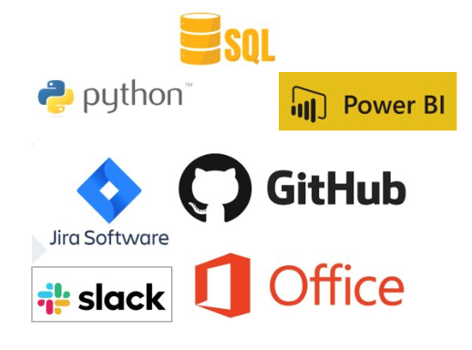

# LogiMax Insights

# Índice
* [Projeto](#projeto-api)
* [Equipe](#equipe)
* [Objetivo do Projeto](#objetivo-do-projeto)
* [Resultados Esperados](#resultados-esperados)
* [Cronograma das Sprints](#cronograma-das-sprints)
* [Backlog do Produto](#backlog-do-produto)
* [Tecnologias utilizadas](#tecnologias-utilizadas)
* [Competências Desenvolvidas](#competências-desenvolvidas)

# Projeto (API) 
O projeto, fundamentado na metodologia Ágil Scrum, visa realizar a análise da eficiência das rotas em uma empresa embarcadora, com o objetivo de aprimorar a distribuição e, assim, diminuir os custos logísticos.

# Equipe

|    Função     | Nome                                  |                                                                                                                                                      LinkedIn & GitHub                                                                                                                                                      |
| :-----------: | :------------------------------------ | :-------------------------------------------------------------------------------------------------------------------------------------------------------------------------------------------------------------------------------------------------------------------------------------------------------------------------: |
| Product Owner | Laura Barros |               |
| Scrum Master  | Felipe Rocha |            |
| Team Member   | Yasmin Fernandes             |                  |
|  Team Member  | Altamira Talpai                |                  |
|  Team Member  | Caroline Alves                 |       |
|  Team Member  |João Pedro       |                      |

# Organograma

 

 
       

      
# Objetivo do Projeto
O propósito deste projeto é aprimorar as rotas de três unidades de uma mesma empresa através da aplicação de métodos de pesquisa operacional. O objetivo é criar um modelo que aumente a eficiência logística, reduzindo custos e tempo de transporte entre as unidades, e assim assegurar uma distribuição mais rápida e econômica dos produtos.

# Resultados Esperados
O resultado desejado do modelo de otimização usando pesquisa operacional é a definição das rotas de transporte mais eficazes entre as três plantas da empresa. O objetivo é que o modelo ofereça um plano detalhado que reduza ao máximo os custos totais de transporte, levando em conta aspectos como distância, capacidade dos veículos, tempo de deslocamento e restrições operacionais.

Espera-se que o modelo matemático determine as rotas mais rápidas e econômicas, assegurando entregas pontuais e minimizando o tempo ocioso dos veículos. Além disso, o modelo deve ser flexível o suficiente para se ajustar a diferentes cenários e condições operacionais, permitindo lidar com imprevistos e variações na demanda.

# Cronograma das Sprints

Sprint | Previsão | Status| Histórico| 
|------|--------|------|--------|
|Kick Off | 03/09/2024 | Concluído | [Ver Relatório](https://fatecspgov.sharepoint.com/:p:/r/sites/Section_PLG003.A994.M.074.146.20242/_layouts/15/Doc2.aspx?action=edit&sourcedoc=%7B7d0d082f-2c7f-4b99-8202-15ceb8cec60e%7D&wdOrigin=TEAMS-WEB.teamsSdk_ns.rwc&wdExp=TEAMS-TREATMENT&wdhostclicktime=1726577626422&web=1) | 
|Backlog| 24/09/2024 | Concluído| [Ver Relatório]()| 
|01| 15/09/2024|  Iniciado |[Ver Relatório](Sprint1.pdf) | 
|02| 05/10/2024| Não iniciado |[Ver Relatório]() | 
|03| 26/10/2024 | Não iniciado |[Ver Relatório]()  | 
|Feira de Soluções| 12/12/2024 | Não iniciado |[Ver Relatório]()  | 

# Backlog do produto
- [x] Modelo de Banco de dados consolidados em SQL
- [x] Visualização gráficas iniciais de métricas importantes, como a quantidade transportada por mês e por veículo, a quantidade transportada por fábrica, o valor do frete por fábrica e a média de aproveitamento por veículo no Power BI
- [ ] Método de transporte e otimização em python
- [ ] Visualizações gráficas dos resultados otimizados 
- [ ] Evoluções e comparativos dos custos

# Funcionalidades e registros das sprints

Apresentação das funcionalidades
Confira a seguir uma demonstraão das funcionalidades para cada tipo de usuário do sistema:

## Tecnologias Utilizadas

 

 
       

## Sprint 1. 
- [x] Estudo ênfase em Python;
- [x] Estudo ênfase em SQL;
- [x] Análise do CIF e FOB.
- [x] Modelo de Banco de dados consolidados em SQL;
- [x] Visualização gráficas iniciais de métricas importantes, como a quantidade transportada por mês e por veículo, a quantidade transportada por fábrica, o valor do frete por fábrica e a média de aproveitamento por veículo no Power BI; 
- [x] Registro técnico do desenvolvimento do projeto e equipe (Relatório 1);
- [x] Relação entre Power BI com os dados do Python;
- [x] Análise das variáveis;

## Sprint 2. 
- [ ] Estudo de otimização em Python;
- [ ] Visualização gráficas da consolidação dos dados em Power BI;
- [ ] Registro técnico do desenvolvimento do projeto e equipe (Relatório 2);
- [ ] Funções para mensurar a produtividade das 3 plantas;
- [ ] Método de Transporte;
- [ ] Evolução dos custos.
      
## Sprint 3 . 
- [ ] Análise dos dados, verificar possíveis melhorias dos dados obtidos;
- [ ] Registro técnico do desenvolvimento do projeto e equipe (Relatório 3);
- [ ] Análise gráfica final em Power BI;
- [ ] Cenário realizado e Cenário comparativo.
      
      
      
      

  
# Competências desenvolvidas

## Hard Skill (saber tecnológico)

Hard Skills desenvolvidas

  
| Tecnologia/Metodologia | Classificação |
| ---------------------- | ------------- |
| GitHub | ★ ★ ★ ★ ★ ★ ★ ☆ ☆ ☆ |
| Gestão de Projetos | ★ ★ ★ ★ ★ ★ ☆ ☆ ☆ ☆ |
| Scrum Master | ★ ★ ★ ★ ★ ★ ★ ☆ ☆ ☆ |
| Prodct Owner | ★ ★ ★ ★ ★ ★ ★ ☆ ☆ ☆ |
| Markdown | ★ ★ ★ ★ ★ ★ ★ ☆ ☆ ☆ |
| Power BI | ★ ★ ★ ★ ★ ★ ★ ☆ ☆ ☆ |
| Python | ★ ★ ★ ★ ★ ★ ★ ☆ ☆ ☆ |

 

## Soft Skill (saber comportamental)

Soft Skills desenvolvidas

| Habilidades | Classificação |
| ---------------------- | ------------- |
| Colaboração | ★ ★ ★ ★ ★ ☆ ☆ ☆ ☆ ☆ |
| Proatividade| ★ ★ ★ ★ ★ ★ ☆ ☆ ☆ ☆ |
| Pensamento Crítico | ★ ★ ★ ★ ★ ★ ★ ☆ ☆ ☆ |
| Gerenciamento de Tempo | ★ ★ ★ ★ ★ ★ ★ ☆ ☆ ☆ |
| Adaptabilidade | ★ ★ ★ ★ ★ ★ ★ ☆ ☆ ☆ |
| Resiliência | ★ ★ ★ ★ ★ ★ ★ ☆ ☆ ☆ |

